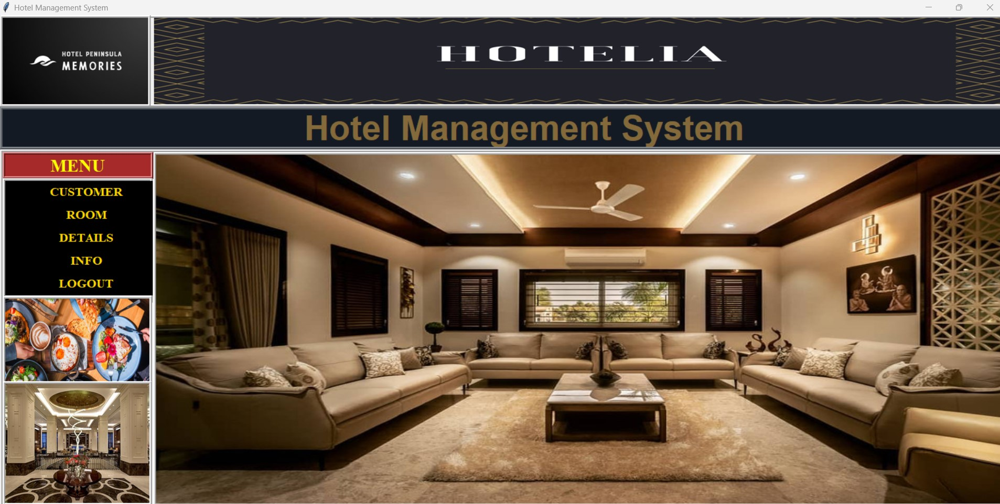
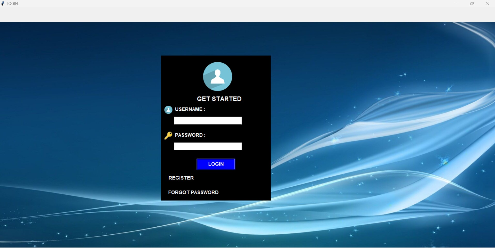

# HOTEL-MANAGEMENT-SYSTEM

The Hotel Management System Project is a software developed to simplify hotel operations by automating them. The project includes a login system with security features and a MySQL database. It collects information about customers, rooms, and other hotel services. You can add, delete, and search for users and customers by their name or phone number.

Additionally, the system provides features for managing room bookings, checking room availability, and generating invoices. It also includes a reporting module to generate various reports such as occupancy rates, revenue, and customer feedback. The user-friendly interface ensures that hotel staff can easily navigate and utilize the system to improve efficiency and enhance customer satisfaction.
<h3>Hotel Page</h3>

<h3>Login Page</h3>

