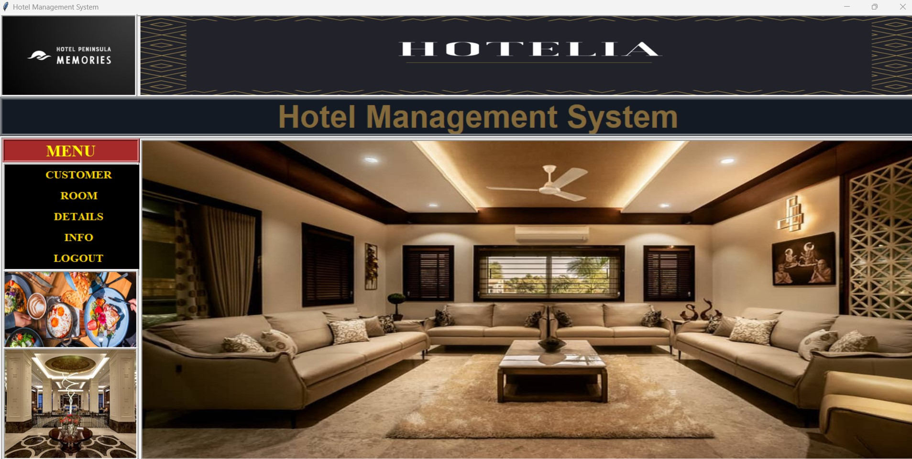

## Hotelia (Hotel Management System in Python & MySQL)

The Hotel Management System Project is a software developed to simplify hotel operations by automating them. The project includes a login system with security features and a MySQL database. It collects information about customers, rooms, and other hotel services. You can add, delete, and search for users and customers by their name or phone number.

Additionally, the system provides features for managing room bookings, checking room availability, and generating invoices. It also includes a reporting module to generate various reports such as occupancy rates, revenue, and customer feedback. The user-friendly interface ensures that hotel staff can easily navigate and utilize the system to improve efficiency and enhance customer satisfaction.


**Repository:** [GitHub Link](https://github.com/ARCHANA130/Hotelia)  

### 📌 Overview  
A **hotel management system** developed in **Python** with **MySQL integration** for room booking, check-ins, check-outs, and billing.

### 🚀 Features  
- 🏨 **Room Booking System**  
- 🧾 **Automated Billing**  
- 📅 **Check-in & Check-out Management**  
- 🎨 **GUI (Tkinter)**  

### 🛠️ Tech Stack  
- **Backend:** Python, MySQL  
- **Frontend:** Tkinter (GUI)  
- **Database:** MySQL  

### 📷 Screenshots  
(_Add UI images here_)

### 🔧 Setup & Installation  
```bash
git clone https://github.com/ARCHANA130/Hotelia.git
cd Hotelia

# Install dependencies
pip install mysql-connector-python

# Run the application
python main.py
```

### 📌 Future Enhancements  
- 📱 Mobile-friendly version  
- 📩 Email/SMS notifications  
- 📊 Data visualization for hotel analytics  

---

=======
<h3>Hotel Page</h3>

<h3>Login Page</h3>


